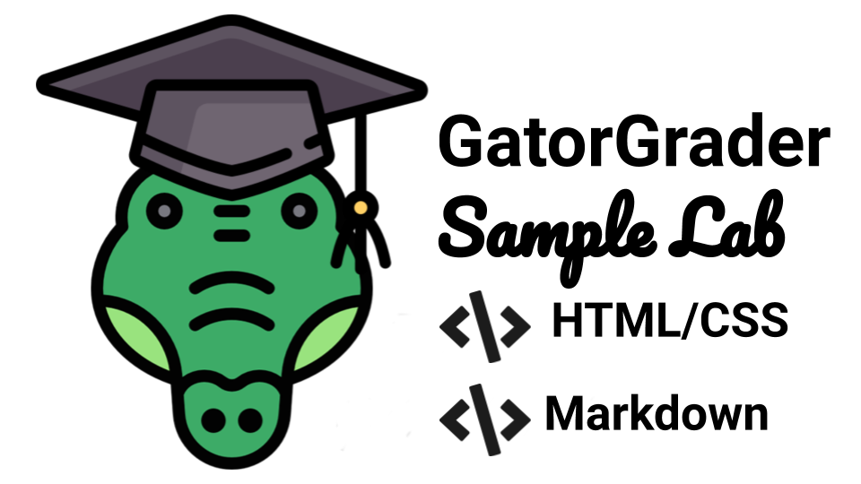

<!---

GatorGrader example that contains a solution to a HTML programming project:
https://github.com/GatorEducator/html-assignment-solution-302-03

This is the companion "starter" repository (i.e., the repository given to students):
https://github.com/GatorEducator/html-assignment-starter-302-03

Learn more about GatorGrader and its supported checks by visiting this web site:
https://github.com/GatorEducator/gatorgrader

Problems? Raise an issue in the issue tracker for this assignment!

-->



<p align="center">
<b>
Automated assessment for an assignment on HTML programming and technical writing in Markdown
</b>
</p>

# html-assignment-solution-302-03

## Table of Contents

* [Table of Contents](#table-of-contents)
* [Introduction](#introduction)
* [Continuous Learning](#continuous-learning)
* [System Commands](#system-commands)
  + [Using Docker](#using-docker)
  + [Using Gradle](#using-gradle)
* [Expected Program Output](#expected-program-output)
* [Automated Checks with GatorGrader](#automated-checks-with-gatorgrader)
* [Downloading Project Updates](#downloading-project-updates)
* [Using Travis CI](#using-travis-ci)
* [System Requirements](#system-requirements)
* [Reporting Problems](#reporting-problems)
* [Receiving Assistance](#receiving-assistance)
* [Project Assessment](#project-assessment)

## Introduction

Designed for use with [GitHub Classroom](https://classroom.github.com/) and
[GatorGrader](https://github.com/GatorEducator/gatorgrader/), this repository
contains the solution for a laboratory assignment in an introductory computer
science class that uses the HTML and CSS programming language. The Travis CI builds
for this repository will pass, as evidenced by a green &#x2714; instead of a red
&#x2717; appearing in the commit logs. An instructor would use this repository
to create a "starter" repository with purposefully omitted features that a
student would then need to add in order to achieve the stated learning
objectives. Please bear in mind that much of the content in this document is
written in its current form under the assumption that it will also accompany the
"starter" repository that an instructor shares with a student through the use of
[GitHub Classroom](https://classroom.github.com/).

This assignment requires a programmer to implement a static web site using the
HTML programming language. Specifically, you will create a travel photography
web site that is an extension of the one in Figure 3.9 of the textbook. For this
laboratory assignment, you will link to a locally stored image that was
downloaded from the Flickr Archive of photographs under a Creative Commons
license. You will also learn how to program in HTML5 using tags. Next, you will
learn how to reference local cascading style sheet (CSS) files and include an
emoji in your web site. Then, you will run a web server to provide local access
to the static web site, specifically loading the default document. Finally, you
will continue to practice using the [HTMLHint](http://htmlhint.com/) static
analysis code tool that can check HTML files for potential errors.

The programmer is also responsible for writing a reflection, stored in the file
`writing/reflection.md`, that responds to the questions in the assignment sheet
and explains the challenges that you faced and the solutions you developed.
Please note that this is also a Markdown file that must adhere to the standards
described in the [Markdown Syntax
Guide](https://guides.github.com/features/mastering-markdown/). Remember, you
can preview the contents of a comitted Markdown file by clicking on the name of
the file in your GitHub repository. Finally, don't forget that your
`writing/reflection.md` file and the file mentioned in the previous paragraph
should both adhere to the Markdown standards established by the [Markdown
linting tool](https://github.com/markdownlint/markdownlint) and the writing
standards set by the [Proselint tool](http://proselint.com/).

The source code in the `index.html` file must also pass additional tests set
by the [GatorGrader tool](https://github.com/gkapfham/gatorgrader). For
instance, GatorGrader will check to ensure that your main file contains the
required header and that, for instance, it contains the correct number of `time`
tags. GatorGrader will also check that you made the required number of
commits to your repository and that your writing contains the specified number
of paragraphs. More details about the GatorGrader checks are included later in
this document and in the assignment sheet.

When you use the `git commit` command to transfer your source code to your
GitHub repository, [Travis CI](https://travis-ci.com/) will initialize a build
of your assignment, checking to see if it meets all of the requirements. If both
your source code and writing meet all of the established requirements, then you
will see a green &#x2714; in the listing of commits in GitHub. If your
submission does not meet the requirements, a red &#x2717; will appear instead.
The instructor will reduce a programmer's grade for this assignment if the red
&#x2717; appears on the last commit in GitHub immediately before the
assignment's due date.

A carefully formatted assignment sheet for this project provides more details
about the steps that a computer scientist should take to complete this
assignment. You can view this assignment sheet by visiting the listing of
laboratories on the course web site.

## Continuous Learning

If you have not done so already, please read all of the relevant [GitHub
Guides](https://guides.github.com/) that explain how to use many of the features
that GitHub provides. In particular, please make sure that you have read the
following GitHub guides: [Mastering
Markdown](https://guides.github.com/features/mastering-markdown/), [Hello
World](https://guides.github.com/activities/hello-world/), and [Documenting Your
Projects on GitHub](https://guides.github.com/features/wikis/). Each of these
guides will help you to understand how to use both [GitHub](http://github.com) and
[GitHub Classroom](https://classroom.github.com/).

Students who want to learn more about how to use
[Docker](https://www.docker.com) should review the [Docker
Documentation](https://docs.docker.com/). Students are also encouraged to review
the documentation for their text editor, which is available for text editors
like [Atom](https://atom.io/docs) and [VS
Code](https://code.visualstudio.com/docs). You should also review the [Git
documentation](https://git-scm.com/doc) to learn more about how to use the Git
command-line client. In addition to talking with the instructor and technical
leader for your course, students are encouraged to search
[StackOverflow](https://stackoverflow.com/) for answers to their technical
questions.

If you are a student working to complete this assignment, you should also read
Chapters 1 and 2 in the course textbook, paying particularly close attention to
Sections 1.5 and 2.1. Please see the course instructor or one of the student
technical leaders if you have questions about any of these reading assignments.

## System Commands

This project invites students to enter system commands into a terminal window.
This assignment uses [Docker](https://www.docker.com) to deliver programs, such
as `gradle` and the source code and packages needed to run
[GatorGrader](https://github.com/GatorEducator/gatorgrader), to a students'
computer, thereby eliminating the need for a programmer to install them on their
development workstation. Individuals who do not want to install Docker can
optionally install of the programs mentioned in the [Project
Requirements](#requirements) section of this document.

### Using Docker

Once you have installed [Docker
Desktop](https://www.docker.com/products/docker-desktop), you can use the
following `docker run` command to start `gradle grade` as a containerized
application, using the [DockaGator](https://github.com/GatorEducator/dockagator)
Docker image available on
[DockerHub](https://cloud.docker.com/u/gatoreducator/repository/docker/gatoreducator/dockagator).

```bash
docker run --rm --name dockagator \
  -v "$(pwd)":/project \
  -v "$HOME/.dockagator":/root/.local/share \
  gatoreducator/dockagator
```

The aforementioned command will use `"$(pwd)"` (i.e., the current directory) as
the project directory and `"$HOME/.dockagator"` as the cached GatorGrader
directory. Please note that both of these directories must exist, although only
the project directory must contain something. Generally, the project directory
should contain the source code and technical writing of this assignment, as
provided to a student through GitHub. Additionally, the cache directory should
not contain anything other than directories and programs created by DockaGator,
thus ensuring that they are not otherwise overwritten during the completion of
the assignment. To ensure that the previous command will work correctly, you
should create the cache directory by running the command `mkdir
$HOME/.dockagator`. If the above `docker run` command does not work correctly on
the Windows operating system, you may need to instead run the following command
to work around limitations in the terminal window:

```bash
docker run --rm --name dockagator \
  -v "$(pwd):/project" \
  -v "$HOME/.dockagator:/root/.local/share" \
  gatoreducator/dockagator
```

Here are some additional commands that you may need to run when using Docker:

* `docker info`: display information about how Docker runs on your workstation
* `docker images`: show the Docker images installed on your workstation
* `docker container list`: list the active images running on your workstation
* `docker system prune`: remove many types of "dangling" components from your workstation
* `docker image prune`: remove all "dangling" docker images from your workstation
* `docker container prune`: remove all stopped docker containers from your workstation
* `docker rmi $(docker images -q) --force`: remove all docker images from your workstation

### Using Gradle

Since the above `docker run` command uses a Docker images that, by default, runs
`gradle grade` and then exits the Docker container, you may want to instead run
the following command so that you enter an "interactive terminal" that will
allow you to repeatedly run commands within the Docker container.

```bash
docker run -it --rm --name dockagator \
  -v "$(pwd)":/project \
  -v "$HOME/.dockagator":/root/.local/share \
  gatoreducator/dockagator /bin/bash
```

Once you have typed this command, you can use the [GatorGrader
tool](https://github.com/GatorEducator/gatorgrader) in the Docker container by
typing the command `gradle grade` in your terminal. Running this command will
produce a lot of output that you should carefully inspect. If GatorGrader's
output shows that there are no mistakes in the assignment, then your source code
and writing are passing all of the automated baseline checks. However, if the
output indicates that there are mistakes, then you will need to understand what
they are and then try to fix them.

## Expected Program Output

To see the expected output of the HTML static website, a screenshot of what it
should look like is in the images directory.

## Automated Checks with GatorGrader

In addition to meeting all of the requirements outlined in the assignment sheet,
your submission must pass the following checks that
[GatorGrader](https://github.com/GatorEducator/gatorgrader) automatically
assesses:

- The command `htmlhint src/www/index.html` executes correctly
- The command output has exactly 1 lines complete
- The command output has exactly 1 of the `no errors found` fragment
- The file index.html exists in the src/www/ directory
- The file reflection.md exists in the writing directory
- The file travels_submission.png exists in the images directory
- The file writing/reflection.md passes mdl
- The file writing/reflection.md passes proselint
- The index.html in src/www/ has at least 5 of the `<blockquote>` fragment
- The index.html in src/www/ has at least 5 of the `<time>` fragment
- The index.html in src/www/ has at least 15 of the `<p>` fragment
- The index.html in src/www/ has exactly 0 of the `TODO` fragment
- The index.html in src/www/ has exactly 1 of the `<h1>Share Your Travels</h1>` fragment
- The index.html in src/www/ has exactly 1 of the `<h3>Reviews</h3>` fragment
- The index.html in src/www/ has exactly 1 of the `<head>` fragment
- The index.html in src/www/ has exactly 1 of the `<html>` fragment
- The index.html in src/www/ has exactly 1 of the `emoji.css` fragment
- The index.html in src/www/ has exactly 1 of the `<body>` fragment
- The index.html in src/www/ has exactly 1 of the `<title>Share Your Travels</title>` fragment
- The index.html in src/www/ has exactly 1 of the `github.css` fragment
- The repository has at least 15 commit(s)
- The reflection.md in writing has at least 5 paragraph(s)
- The reflection.md in writing has at least 100 word(s) in every paragraph

If [GatorGrader's](https://github.com/GatorEducator/gatorgrader) automated
checks pass correctly, the tool will produce the output like the following in
addition to returning a zero exit code (which you can access by typing the
command `echo $?`).

```
        ┏━━━━━━━━━━━━━━━━━━━━━━━━━━━━━━━━━━━━━━━━━━━━━━━━━━━━━━━━━━━━━━━━━━━━┓
        ┃ Passed 23/23 (100%) of checks for html-assignment-solution-302-03! ┃
        ┗━━━━━━━━━━━━━━━━━━━━━━━━━━━━━━━━━━━━━━━━━━━━━━━━━━━━━━━━━━━━━━━━━━━━┛
```

## Downloading Project Updates

If GatorGrader's maintainers push updates to this sample assignment and you
received it through GitHub Classroom and you would like to also receive these
updates, then you can type this command in the main directory for this
assignment:

```
git remote add download git@github.com:GatorEducator/html-assignment-solution-302-03
```

You should only need to type this command once; running the command additional
times may yield an error message but will not negatively influence the state of
your Git repository. Now, you are ready to download the updates provided by the
GatorGrader maintainers by typing this command:

```
git pull download master
```

This second command can be run whenever the maintainers needs to provide you
with new source code for this assignment. However, please note that, if you have
edited the files that we updated, running the previous command may lead to Git
merge conflicts. If this happens, you may need to manually resolve them with the
help of the instructor or a student technical leader. Finally, please note that
the [Gradle plugin](https://github.com/GatorEducator/gatorgradle) for
[GatorGrader](https://github.com/GatorEducator/gatorgrader) will automatically
download the newest version of GatorGrader.

## Using Travis CI

This assignment uses [Travis CI](https://travis-ci.com/) to automatically run
[GatorGrader](https://github.com/GatorEducator/gatorgrader) and additional
checking programs every time you commit to your GitHub repository. The checking
will start as soon as you have accepted the assignment &mdash; thus creating your own
private repository &mdash; and the course instructor and/or GitHub enables Travis for
it. If you are using Travis for the first time, you will need to authorize
Travis CI to access the private repositories that you created on GitHub. If you
do not see either a yellow &#9679; or a green &#x2714; or a red &#x2717; in your
listing of commits, then please ask the instructor to see whether or not
Travis CI was correctly enabled.

## System Requirements

We developed this assignment to work with the following software and versions:

- Docker Desktop
- Operating Systems
  - Linux
  - MacOS
  - Windows 10 Pro
  - Windows 10 Enterprise
- Programming Language Tools
  - Gradle 5.4
  - MDL 0.5.0
  - OpenJDK 11.0.4
  - Proselint 0.10.2
  - Python 3.6 or 3.7

## Reporting Problems

If you have found a problem with this assignment's provided source code or
documentation, then you can go to the [HTML Assignment Solution
302-03](https://github.com/GatorEducator/html-assignment-solution-302-03)
repository and [raise an
issue](https://github.com/GatorEducator/html-assignment-solution-302-03/issues).
If you have found a problem with the [GatorGrader
tool](https://github.com/GatorEducator/gatorgrader) and the way that it checks
your assignment, then you can also [raise an
issue](https://github.com/GatorEducator/gatorgrader/issues) in that repository.
To ensure that your issue is properly resolved, please provide as many details
as is possible about the problem that you experienced. If you discover a problem
with the assignment sheet for this project, then please raise an issue in the
GitHub repository that provides the assignment sheets for your course.

Whenever possible, individuals who find, and use the appropriate GitHub issue
tracker to correctly document, a mistake in any aspect of this assignment will
receive free [GitHub stickers](https://octodex.github.com/) and extra credit
towards their grade for the project.

## Receiving Assistance

If you are having trouble completing any part of this project, then please talk
with either the course instructor or a student technical leader during the
course session. Alternatively, you may ask questions in the Slack workspace for
this course. Finally, you can schedule a meeting during the course instructor's
office hours.

## Project Assessment

Taking inspiration from the principles of [specification-based
grading](http://rtalbert.org/return-to-specs-grading-calculus/), the grade that
a student receives on this assignment will have the following components:

- **Percentage of Correct GatorGrader Checks**: Students are encouraged to
  repeatedly try to implement a Java program that passes all of GatorGrader's
  checks by, for instance, creating a program that produces the correct output.
  Students should also repeatedly revise their technical writing to ensure that
  it also passes all of GatorGrader's checks about, for instance, the length of
  its content and its appropriate use of Markdown.

- **Travis CI Build Status**: Since additional checks on the source code and/or
  technical writing may be encoded in Travis CI's actions and, moreover, all of
  the GatorGrader checks are also run in Travis CI, students will receive a
  checkmark grade if their last before-the-deadline build passes and a green
  &#x2714; appears in their GitHub commit log instead of a red &#x2717;. As with
  the previous grading component, students are encouraged to repeatedly revise
  their source code and technical writing in an attempt to get their Travis CI
  build to pass.

- **Mastery of Technical Writing**: Students will also receive a checkmark grade
  when the responses to the technical writing questions presented in the
  `writing/reflection.md` reveal a mastery of both writing skills and technical
  knowledge. To receive a checkmark grade, the submitted writing should have
  correct spelling, grammar, and punctuation in addition to following the rules
  of Markdown and providing technically accurate answers. Students are
  encouraged to ask the course instructor or a student technical leader to use
  the GitHub issue tracker to provide feedback on their mastery of technical
  writing skills.

- **Mastery of Technical Knowledge and Skills**: Students will receive also
  receive a checkmark grade when their GitHub repository reveals that they have
  mastered all of the technical knowledge and skills developed during the
  completion of this project. As a part of this grade, the instructor will
  assess aspects of the project including, but not limited to, the use of
  effective source code comments and Git commit messages. Students are
  encouraged to ask the course instructor or a student technical leader to use
  the GitHub issue tracker to provide feedback on how well their work
  demonstrates mastery of the assignment's technical knowledge and skills.

All grades for this project will be reported through a student's GitHub
repository using either messages in the GitHub commit log or issues raised in
the issue tracker. Students should ask questions about their grade for this
project in GitHub so as to facilitate an effective conversation about the
submitted deliverables.
